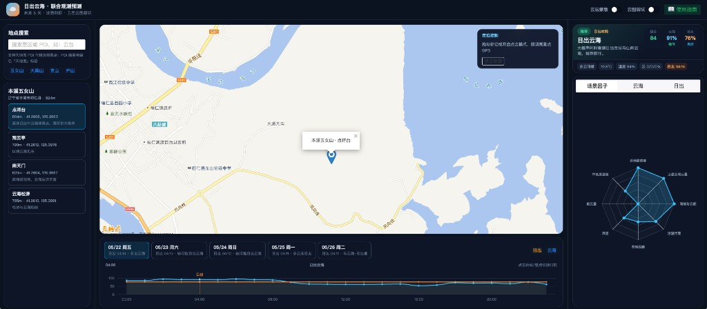
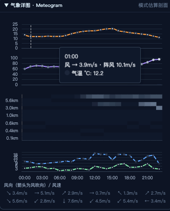
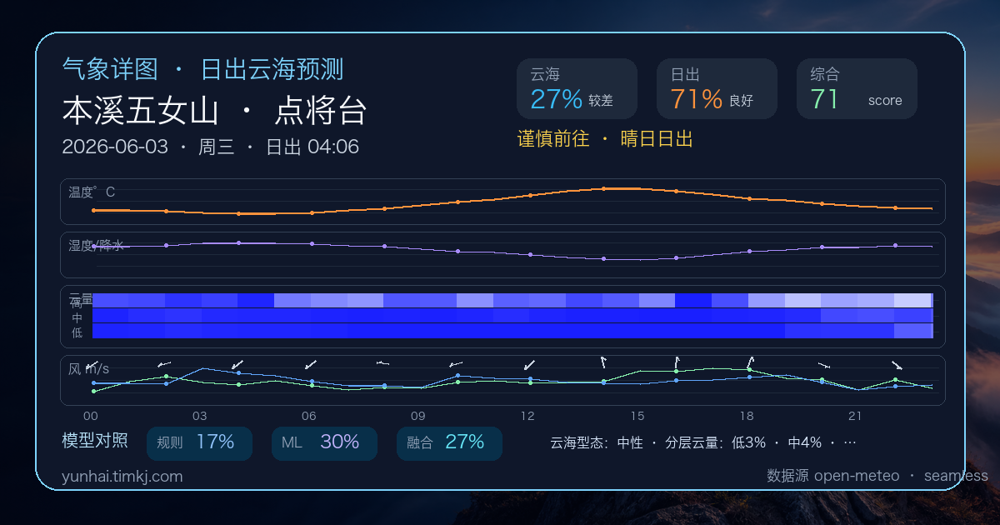
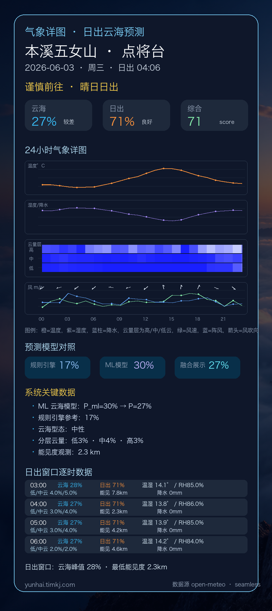

<div align="center">

# 🌅 日出云海 · 联合观测预测

**未来 5 天逐小时云海 / 日出观测概率 · 模糊逻辑 + 标注驱动 ML · Meteogram 气象详图 · AI 解读与分享图**

<br />

[](https://yunhai.timkj.com/)
[](https://yunhai.timkj.com/docs/index.html)
[](LICENSE)

<br />

[立即体验 →](https://yunhai.timkj.com/) · [预测模型](https://yunhai.timkj.com/docs/prediction-model.html) · [系统架构](https://yunhai.timkj.com/docs/architecture.html)

<br />



*本溪五女山 · 点将台 — 5 天时间轴、双场景概率、分层因子拆解与雷达图*

</div>

---

## ✨ 项目简介

面向摄影爱好者、景区运营与气象景观研究者的 **免费 Web 预测系统**：在地图上选择观景点（或搜索 POI），查看未来 **5 天 × 120 小时** 的云海、日出观测参考概率，并结合 **Himawari 卫星红外云图** 做区域云量辅助判断。

> 🌍 **在线地址：[https://yunhai.timkj.com/](https://yunhai.timkj.com/)**

系统采用 **「规则引擎 + 机器学习 + 底层观测」三层因子架构**：

| 层级 | 说明 |
|------|------|
| **规则引擎** | 基于文献的模糊逻辑评分（850/700 hPa 垂直场、逆温、低云/能见度补偿、Type A/B 型态） |
| **ML 模型** | 日出窗口 03–07 点由标注数据训练的 Logistic 回归接管概率（v2，22 维日特征） |
| **底层观测** | 分层云量、垂直场剖面、云海型态、地面态等原始气象字段完整展示 |

内置 **五女山、大黑山、黄山、庐山** 等精选景区观景点，也支持天地图 POI 搜索与地图拖拽自定义坐标。配套 **开放标注 / 审核 / ML 训练** 共建闭环（见下方 [共建计划](#-日出云海预测模型--共建计划)）。

> ⚠️ 预测结果为**参考概率**，基于 Open-Meteo 免费预报与本地模型，**不替代**官方气象预警与现场判断。

---

## 🖼️ 功能亮点

| 功能 | 说明 |
|------|------|
| 🗺️ **地图选点** | 天地图底图，POI 搜索、标记拖拽 / 点击微调坐标 |
| 📊 **双场景预测** | 云海 + 日出概率，综合场景评分与五级适宜等级 |
| 🧠 **混合预测引擎** | 03–07 点 ML 概率 + 完整规则因子 + 底层观测数据 |
| ⏱️ **5 天时间轴** | 逐小时折线图，标注日出时刻与推荐观测窗口 |
| 📡 **因子拆解** | 雷达图（加权评分维度）+ 列表（含模型层 / 观测层） |
| 🛰️ **卫星云图** | Himawari 红外裁切，当天已发生时段轻量校正 |
| 🌦️ **Meteogram 气象详图** | 温度、湿度/降水、分层云量、风速/阵风/风向，辅助对标专业气象产品 |
| 🤖 **AI 出行解读** | DeepSeek/OpenAI 兼容接口，结合逐小时天气、规则引擎与 ML 输出给出一致性解读 |
| 🔗 **预测分享** | 分享页、OG 预览图、竖版长图；分享图动态渲染，不落盘占用硬盘 |
| 🏔️ **精选景区** | 预置观景点海拔、坐标、季节权重；支持全国 POI |
| 📝 **开放标注** | 匿名贡献 ID、POI/社区点云海标注、审核后入训练集 |
| 🔬 **标注回测** | 开放标注页、Historical Forecast 回测、Admin 审核与重训 API |

---

## 🆕 最新上线：气象详图与分享图

### Meteogram 气象详图

预测面板内置专业气象详图，方便把系统概率与底层天气条件一起核对：

- **温度曲线**：展示全天温度变化，识别日出前后冷却条件。
- **湿度 / 降水**：湿度曲线叠加降水柱，辅助判断水汽和扰动。
- **分层云量**：按高 / 中 / 低云显示云层结构，替代单一总云量判断。
- **风速 / 阵风 / 风向**：Open-Meteo 风向按“风吹向”展示，避免与气象原始“来向”混淆。



### 分享预测结果

分享功能包含两类图片：

- **OG 横版预览图**：`/api/share/{share_id}/og.png`，用于微信、社交平台链接卡片预览，尺寸 `1200x630`。
- **竖版长分享图**：`/api/share/{share_id}/image.png`，用于用户打开后长按保存 / 转发。高度按内容动态计算，当前包含 24 小时气象详图、模型对照、系统关键数据与日出窗口逐时表。





分享图本身**不是长期存储文件**，而是根据 Redis 中的分享快照动态渲染 PNG。默认分享快照有效期为 **3 天**（`SHARE_SNAPSHOT_TTL=259200`），过期后分享页和图片都会失效，不会持续占用系统硬盘。

---

## 🌤️ 日出云海预测模型 · 共建计划

> **最终目标**：建成一套**全国可扩展、观景点级可校准**的日出—云海联合预测体系——任何人可在地图上选点、微调坐标、贡献现场标注；数据经审核后驱动**点位专属模型**与**全国 POI 通用模型**迭代，让预测从「五女山金标准」逐步覆盖更多真实观景点。

### 计划愿景（我们要做成什么）

```text
  全国 POI 选点 ──→ 精确坐标 ──→ 现场标注（云海 / 日出）
         │                              │
         ▼                              ▼
   社区点位库                    审核通过的标注样本
         │                              │
         ├──────────► 单点专属 ML ◄─────┤
         │                              │
         └──────────► 全国 POI 通用 ML ◄─┘
                              │
                              ▼
              线上预测：规则引擎 + 分层 ML 融合 + 可解释因子
```

**长期价值**：

1. **观景点级精度**：同一套规则无法套用全国；每个高频点位可有独立校准模型与 Type A/B 型态权重。
2. **数据飞轮**：用户标注 → 审核 → 训练 → 部署 → 预测更准 → 吸引更多人标注。
3. **开放共建**：无需注册账号，浏览器匿名 ID 即可贡献；高质量点位可「精选落库」进入官方景区列表。
4. **专业可解释**：保留底层气象观测与规则因子，ML 只做日出窗口概率校准，不黑盒替代业务判断。

### 共建模块说明

| 模块 | 说明 | 状态 |
|------|------|------|
| **社区点位** | POI 或地图选点自动注册为 `cs_` 社区点，500 m 去重；可收藏深链 `/?loc=cs_xxx` | ✅ **已完成** |
| **点位精确位置修改** | 预测页地图拖拽 / 点击放置标记，微调 WGS84 坐标后再预测 | ✅ **已完成**（会话内微调） |
| | 社区点坐标持久化修改、贡献者编辑点位名称/海拔 | ✅ **已完成**（标注页 PATCH + 精选 JSON 同步） |
| **日出 · 云海标注** | 日出窗口 03:00–07:00 三档云海标注（无 / 部分 / 完整） | ✅ **已完成**（云海） |
| | 日出质量独立标注（可见 / 遮挡 / 不可拍） | ✅ **已完成**（入库；**暂不入**云海 ML，待日出模型） |
| **开放贡献与审核** | 匿名 Contributor ID、30 条/日限额、pending → approved 审核 | ✅ **已完成** |
| | 标注页 Admin 可视化审核队列 UI | 🔶 **部分**（API 已有，`label.html?admin=1` 待增强） |
| **社区点位专属模型** | 单点 accumulated ≥10 天 approved 后可训练/绑定专属 ML | 🔶 **部分**（融合权重已分 spot；独立 pkl 未实现） |
| **全国 POI 通用模型** | 汇总多地区 approved 样本，训练跨点位泛化 ML | 🔶 **部分**（全局 `--approved-only` 训练已有；POI 专项管线规划中） |
| **精选落库** | approved ≥15 天 → 写入 `scenic-spots/*.json`，搜索可见 | ✅ **已完成**（Admin API） |
| **定期重训** | 标注增量或周期触发自动重训 + LOOCV 门禁部署 | 🔶 **部分**（手动 `POST .../train`；cron 未接） |
| **深链与收藏** | `/?spot=&vp=`、`/?lat=&lng=`、`/label.html?...` 直达预测/标注 | ✅ **已完成** |

图例：**✅ 已完成** · **🔶 部分完成** · **⏳ 规划中**

### 当前已上线（可立即使用）

| 入口 | 地址 |
|------|------|
| 预测主页 | [yunhai.timkj.com](https://yunhai.timkj.com/) |
| 开放标注 | [yunhai.timkj.com/label.html](https://yunhai.timkj.com/label.html) |
| 使用指南 | [docs/index.html](https://yunhai.timkj.com/docs/index.html) |

**贡献流程**：主页选 POI → 「标注此点位」→ 选择日期 → 1/2/3 标注云海 → 可选标注日出质量 → 社区点可持久化编辑坐标。

**Admin 流程**（需 Token）：审核队列 → approve/reject → 达标社区点 `curate` 落库 → `train` 重训云海 ML（不含日出质量字段）。

详细设计见 [`internal/open-annotation-plan.md`](internal/open-annotation-plan.md) · 标注操作见 [`internal/CLOUDSEA-LABEL.md`](internal/CLOUDSEA-LABEL.md)

### 共建路线图（尚未完成的部分）

| 阶段 | 目标 |
|------|------|
| **近期** | 模型版本与贡献数公开展示；日出 ML 训练脚本（基于 `sunrise_quality`） |
| **中期** | **单点专属 ML**（每社区点/精选点独立 pkl + 自动切换） |
| **远期** | **全国 POI 通用 ML**（跨纬度/地形泛化）；定时重训 CI；贡献排行榜 |

**确认结论（截至当前版本）**：

- 共建计划的 **P1 核心**（社区点、POI 标注、开放贡献、审核 API、深链、精选落库 API）**已实现并部署**。
- **P2/P3 深化**（单点独立模型、全国 POI 模型、**日出 ML 训练**、自动重训）**部分进行中**。

欢迎通过 Issue / PR 参与：补充观景点 JSON、提交标注样本、改进单点/全国模型训练脚本。

---

## 🏔️ 内置景区

| 景区 | 说明 |
|------|------|
| 本溪五女山 | 点将台、观云亭（金标准标注与 ML 主标定区） |
| 大连大黑山 | 观日峰等 |
| 黄山 / 庐山 / 泰山 / 峨眉山 / 华山 / 五台山 | 经典观云观日点位 |

数据文件：[`data/scenic-spots/`](data/scenic-spots/)，可自行扩展 JSON。

---

## 🛠️ 技术栈

```
┌──────────────────────────────────────────────────────────────────┐
│  Vue 3 · Vite · TypeScript · Tailwind · Naive UI · ECharts      │
│  天地图 JS API 4.0 · Pinia · axios · suncalc                     │
├──────────────────────────────────────────────────────────────────┤
│  FastAPI · Uvicorn · httpx · Pydantic · scikit-learn · Redis    │
│  Open-Meteo Forecast / Pressure Levels · GIBS Himawari · SQLite  │
│  Pillow OG/分享图渲染 · DeepSeek/OpenAI 兼容 AI 解读              │
│  模糊逻辑 v2（Archetype）· ML v2 · 标注样本库 · 行为分析          │
└──────────────────────────────────────────────────────────────────┘
```

---

## 🚀 快速开始

### 环境要求

- Node.js 20+ · Python 3.12+ · （可选）Redis 7
- [天地图开发者 Key](https://console.tianditu.gov.cn/)（浏览器端类型）

### 1. 克隆与配置

```bash
git clone https://github.com/TIMtechnology/yunhai.git
cd yunhai
cp frontend/.env.example frontend/.env.local
# 编辑 frontend/.env.local，填入 VITE_TIANDITU_KEY
```

### 2. 本地开发

```bash
# 终端 1 — 后端
cd backend
python3 -m venv .venv && source .venv/bin/activate
pip install -r requirements.txt
uvicorn app.main:app --reload --port 8000

# 终端 2 — 前端
cd frontend && npm install && npm run dev
# http://localhost:5173
```

### 3. 启用云海 ML（可选）

```bash
export CLOUDSEA_ML_ENABLED=true
export CLOUDSEA_MODEL_PATH=../data/cloudsea/models/cloudsea_ml_v2.pkl
```

### 4. Docker

```bash
docker compose up --build          # 开发
bash scripts/build-amd64.sh        # 生产 amd64 镜像
docker compose -f docker-compose.prod.yml up -d
```

生产部署见 [`docker-compose.deploy.yml`](docker-compose.deploy.yml)。

---

## 📡 API 概览

| 方法 | 路径 | 说明 |
|------|------|------|
| `GET` | `/health` | 健康检查 |
| `GET` | `/api/spots/search?q=` | 搜索景区 |
| `GET` | `/api/predict/{spot_id}/viewpoint/{viewpoint_id}` | 预置观景点预测 |
| `POST` | `/api/predict` | 自定义坐标预测 |
| `GET` | `/api/meteo/profile` | Meteogram 垂直云量 / 湿度 / 位势高度剖面 |
| `POST` | `/api/advisory/daily-brief` | AI 当日出行解读（可刷新绕过缓存） |
| `POST` | `/api/share/snapshot` | 创建预测分享快照 |
| `GET` | `/api/share/{share_id}` | 读取分享快照 JSON |
| `GET` | `/api/share/{share_id}/og.png` | 横版 OG 预览图（动态渲染） |
| `GET` | `/api/share/{share_id}/image.png` | 竖版长分享图（动态渲染） |
| `GET` | `/s/{share_id}` | 公开分享页 |
| `GET` | `/api/contribute/cloudsea/*` | 开放标注（Header: `X-Contributor-Id`） |
| `PATCH` | `/api/contribute/locations/{id}` | 编辑我的社区点位名称/坐标/海拔 |
| `GET` | `/api/satellite/cloud` | Himawari 红外裁切 |
| `GET` | `/api/internal/cloudsea/review-queue` | 待审标注（Admin Token） |
| `POST` | `/api/internal/cloudsea/train` | 手动重训 ML（Admin Token） |
| `GET` | `/api/internal/backtest/predict` | 历史日回测（Admin Token） |

Swagger：`http://localhost:8000/docs`

---

## 🔬 ML 与标注工作流

```bash
# 1. 回填标注日完整垂直场气象
python3 scripts/backfill_meteo_hourly.py

# 2. 训练 ML（仅 approved 标注）
python3 scripts/train_cloudsea_model.py --approved-only

# 3. 模型输出
# data/cloudsea/models/cloudsea_ml_v2.pkl
```

**开放标注页**：https://yunhai.timkj.com/label.html（无需 Token，浏览器自动生成贡献 ID）

**Admin**：审核 / 落库 / 重训见 [共建计划](#-日出云海预测模型--共建计划) · 操作细节 [`internal/CLOUDSEA-LABEL.md`](internal/CLOUDSEA-LABEL.md)

---

## 📁 项目结构

```
yunhai/
├── frontend/                 # Vue 3 主应用 + label.html 标注页
├── backend/app/
│   ├── adapters/             # Open-Meteo、Historical、Himawari WMS
│   ├── engine/               # cloudsea_scorer · cloudsea_ml · cloudsea_features
│   ├── routers/              # api · advisory · share · cloudsea · contribute · analytics
│   └── services/             # predictor · meteo_profile · share_store · share_og_renderer
├── data/
│   ├── scenic-spots/         # 景区 JSON
│   ├── share-assets/         # 分享图背景与中文字体资源
│   └── cloudsea/             # 标注库 cloudsea.db · ML 模型
├── docs/docs/                # 用户文档（同步至 frontend/public/docs）
├── internal/                 # 标注说明 · 分析看板（本地内部）
├── scripts/                  # build-amd64 · train · backfill
└── Dockerfile
```

---

## 📖 文档

| 文档 | 链接 |
|------|------|
| 使用指南 | [/docs/index.html](https://yunhai.timkj.com/docs/index.html) |
| 数据来源 | [/docs/data-sources.html](https://yunhai.timkj.com/docs/data-sources.html) |
| 预测模型 | [/docs/prediction-model.html](https://yunhai.timkj.com/docs/prediction-model.html) |
| 系统架构 | [/docs/architecture.html](https://yunhai.timkj.com/docs/architecture.html) |
| 界面设计 | [/docs/ui-design.html](https://yunhai.timkj.com/docs/ui-design.html) |

源码副本：`frontend/public/docs/`

---

## 🌐 部署

官方实例：**[yunhai.timkj.com](https://yunhai.timkj.com/)** · Docker 单镜像 + Redis · 时区 `Asia/Shanghai`

---

## 🤝 贡献

欢迎 Issue / PR：观景点 JSON、**云海/日出现场标注**、单点/全国模型优化、文档完善等。

参与 **日出云海预测模型共建** 见 [共建计划](#-日出云海预测模型--共建计划)。

---

## 📄 开源协议

[MIT License](LICENSE) · © 2026 [timkj](https://yunhai.timkj.com/)

---

<div align="center">

**如果这个项目对你规划观云、拍日出或开展研究有帮助，欢迎 Star ⭐**

[⬆ 回到顶部](#-日出云海--联合观测预测)

</div>
