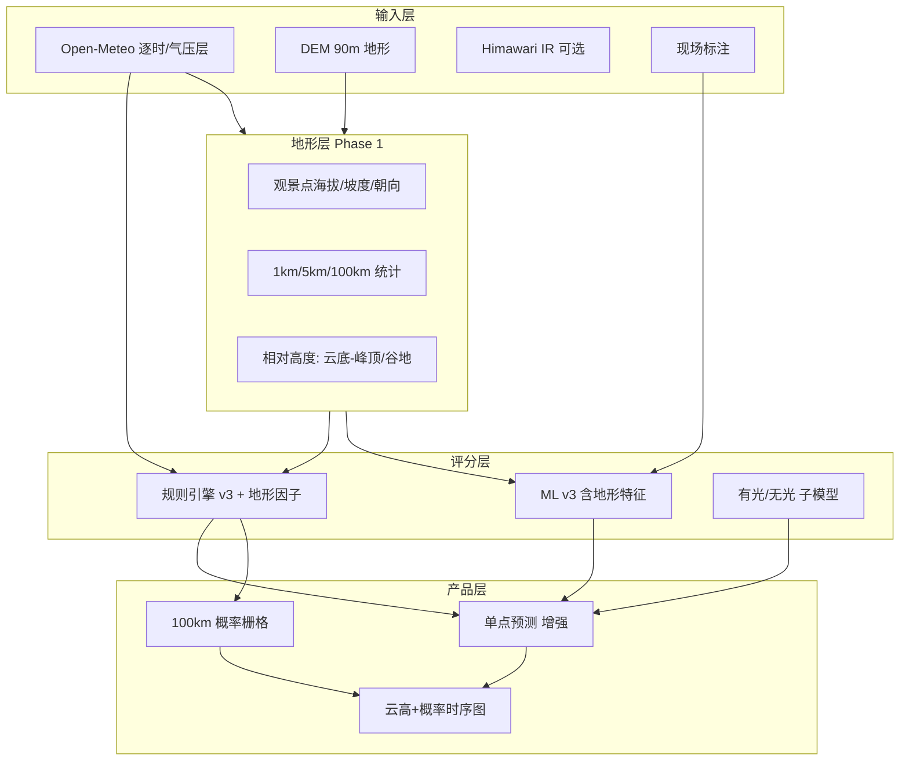

# 地形增强 + 区域云海产品方案

> 目标：在现有 yunhai 单点预测基础上，引入 **DEM 地形场**，向莉景天气类能力靠拢——**云高 vs 海拔、100 km 概率场、有光/无光、逐时云高曲线**；同时提升单点预测物理合理性。  
> 状态：方案稿 · 2026-05-29 · 未开工

---

## 1. 现状基线（我们已有什么）

| 能力 | 实现 | 局限 |
|------|------|------|
| 观景点海拔 | Open-Meteo Elevation API（Copernicus DEM 90m 单点） | 仅 **一个标量**，无周边地形 |
| 云底估算 | `cloud_base ≈ (T − Td) × 125` | 模式网格点估算，非真实层结高度 |
| 海拔匹配因子 | `_score_elevation_match`：观景点是否在 `[云底, 云底+800m]` | 未用 **相对高度、山谷/峰顶、是否在云上** |
| 气象场 | Open-Meteo 逐时 + 850/925/700 hPa | **9 km 级网格**，观景点尺度偏差大 |
| 卫星 | Himawari 红外裁切（辅助） | 未做区域云高反演 |
| ML | 22 维日聚合特征，无地形维 | 训练仍偏五女山单点气候 |
| 产品形态 | 单点双环 + 时间轴 | 无 **100 km 热力图**、无 **云高折线** |

**结论**：已有「点海拔 + 云底公式」的雏形，但 **缺少地形场（DEM）** 和 **空间化产品**，这是与莉景差距的主因。

---

## 2. 莉景类能力拆解（要对标什么）

| 莉景 UI 元素 | 背后需要的计算 | 我们可否做 |
|--------------|----------------|------------|
| 100 km 彩色网格 | 区域网格 × 逐时云海概率 | ✅ 可做（Phase 2） |
| 附近概率 10–90% | 网格概率 min–max 或分位数 | ✅ |
| 云海高度 985 m | 云底/层结高度（模式或估算） | ✅ 已有估算，可加强 |
| 附近 1 km 最高海拔 646 m | **DEM 窗口 max** | ✅ Phase 1 |
| 观景点在云上/云下 | `viewer_elev` vs `cloud_base` / `cloud_top` | ✅ Phase 1 |
| 有光云海 / 光照分档 | 日出方位 + 中高云 + 能见度 + 云厚 | 🔶 Phase 2（部分已有 sunrise scorer） |
| 3 天逐时柱 + 云高线 | 逐时概率 + 逐时云高 | ✅ Phase 1–2 |
| 会员 3 天 | 产品策略，非算法 | — |

---

## 3. 核心思路：从「点」到「点 + 地形场 + 区域场」



---

## 4. 地形数据方案

### 4.1 DEM 数据源（推荐优先级）

| 来源 | 分辨率 | 许可 | 用法 |
|------|--------|------|------|
| **Copernicus DEM GLO-90** | 90 m | 免费 | 与 Open-Meteo Elevation 同源，**首选** |
| SRTM 30m / ASTER | 30 m | 免费 | 景区精细区可离线切片 |
| 天地图 / 国内 DEM | 视授权 | 需合规 | 后期国内 POI 密集区 |

**建议**：Phase 1 用 **Copernicus 90m**，与现有 `fetch_elevation` 一致；景区热点预下载 **0.01°×0.01° GeoTIFF 切片** 放 `data/dem/` 或 Redis 缓存。

### 4.2 每个观景点预计算的地形指标

以 `(lat, lng)` 为中心，从 DEM 采样：

| 指标 | 窗口 | 用途 |
|------|------|------|
| `elev_viewpoint` | 双线性插值 | 观景点海拔（校验 Open-Meteo） |
| `elev_max_1km` | ~1 km 半径 | 莉景「附近 1 km 最高海拔」 |
| `elev_max_5km` | ~5 km | 山谷云海：峰顶是否穿出云層 |
| `elev_min_5km` | ~5 km | 谷地湿度积聚 |
| `elev_relief_5km` | max − min | 地形起伏 → Type A 山谷云海 |
| `slope_deg` | 观景点 | 坡度 |
| `aspect_deg` | 观景点 | 坡向 → 日出光照 |
| `horizon_elev_e` | 东向 10 km 剖面 max | 日出是否被地形挡 |

**API 形态**（新增）：

```
GET /api/terrain/context?lat=&lng=
→ { elev_viewpoint, elev_max_1km, elev_max_5km, relief_5km, aspect_deg, ... }
```

实现：`backend/app/adapters/dem.py` + 本地 COG/GeoTIFF 或 **rio-tiler** 按需读取；无切片时回退 Open-Meteo 单点 + 粗估（relief 用 null）。

### 4.3 云高 vs 地形（物理判据）

对每个时刻：

```
cloud_base_m  = estimate_cloud_base(T, Td)     # 已有
cloud_top_m   = cloud_base_m + f(cloud_low, cloud_mid)  # 新增估算
viewer_m      = elev_viewpoint

above_cloud   = viewer_m > cloud_top_m          # 站在云海之上（俯瞰）
in_cloudsea   = cloud_base_m < viewer_m < cloud_top_m  # 人在云里
valley_fill   = cloud_base_m < elev_max_5km AND viewer_m >= elev_max_5km - 200  # 山谷填云
under_fog     = cloud_base_m < 100 AND viewer_m < elev_max_1km AND vis < 2km  # 近地面雾
```

输出到因子与场景：

- **站在云上**：高概率俯瞰云海（Type A 典型）
- **人在云内**：partial，能见度主导
- **云在谷底、人在山顶**：full 潜力高
- **云底低于谷地 + 低能见度**：雾型排除（已有 fog_exclude，用 DEM 加强）

---

## 5. 评分引擎 v3（规则层改动）

在 `cloudsea_scorer.py` 增加地形因子（建议权重 0.08–0.12 合计）：

| 新因子 | 说明 |
|--------|------|
| `terrain_relief` | 5 km 起伏大 → 山谷云海加分 |
| `cloud_vs_peak` | `cloud_base` 与 `elev_max_5km` 差值 |
| `viewer_cloud_layer` | 三态：云上 / 云中 / 云下 |
| `horizon_block` | 东向地平线仰角 vs 日出高度角 |
| `fog_vs_valley` | 低云底 + 低峰高 → 雾，非云海 |

**场景标签**（`scenario.py`）新增：

- `fog_in_valley`：近地面雾 · 非观赏云海（已有 fog_exclude 可合并）
- `above_cloudsea`：站在云海之上 · 俯瞰
- `in_cloud_layer`：人在云層中 · 谨慎前往

---

## 6. ML v3 特征扩展

在 `DAY_FEATURE_NAMES` 增加（需重训）：

```
elev_viewpoint, elev_max_1km, elev_max_5km, relief_5km,
cloud_base_minus_peak, viewer_above_cloud_hours,
horizon_block_sunrise_hour, ...
```

**训练注意**：

- 社区点/POI 已有 `lat/lng`，训练脚本从 DEM 服务批量拉地形
- 五女山金标准仍作校准集
- **sunrise_quality** 单独训练日出模型（见 CLOUDSEA-LABEL.md），不与云海 v3 混训

**预期收益**（需 LOOCV 验证）：

- 单点 LOOCV：+2–5%（地形对 Type A 日帮助大）
- 雾日误判为云海：显著下降

---

## 7. 区域 100 km 云海产品（Phase 2）

### 7.1 网格设计

- 中心：用户选点 `(lat0, lng0)`
- 范围：半径 **100 km**（与莉景一致）
- 分辨率：**0.05° (~5 km)** → 约 40×40 = **1600 格**；或 0.1° 降成本
- 每格：
  - `elev`：DEM
  - 气象：Open-Meteo **单点预报** 先共用中心网格（Phase 2a）；Phase 2b 多格并行请求或换 **区域 NWP**

### 7.2 每格云海概率

```
P(cell) = f(NWP_cell, elev_cell, relief_local, archetype_cell)
```

Phase 2a 简化：**同一 NWP 场 + 不同 DEM** → 反映「同一天气系统下，哪些山头更容易出云海」（成本低，已有物理意义）。

Phase 2b：每格独立拉 Open-Meteo（1600 次不可行）→ 改用：

- Open-Meteo **多坐标批量**（若 API 支持）或
- 下载 **ECMWF 公开 GRIB 子集** 自建插值（工作量大）

**推荐路径**：2a 先做（共享 NWP + DEM 差异），验证产品价值后再上 2b。

### 7.3 API

```
GET /api/cloudsea/region?lat=&lng=&date=&hour=
→ {
  "center": { lat, lng },
  "radius_km": 100,
  "grid": { "lats": [], "lngs": [], "prob": [][], "cloud_base_m": [][] },
  "summary": {
    "prob_min": 10, "prob_max": 90,
    "elev_max_1km": 646,
    "cloud_base_m": 985,
    "peak_prob_time": "2026-05-13T01:00",
    "light_quality": "lit" | "dim" | "dark"
  },
  "series_72h": [ { "time", "prob_center", "cloud_base_m", "light_tier" }, ... ]
}
```

### 7.4 前端

- 新 Tab「区域云海」或独立页 `/region.html`
- 天地图/Leaflet **Canvas 热力层**（复用现有 MapPanel 栈）
- 下方：**3 天柱状图 + 云高折线**（ECharts，与 ForecastTimeline 类似）
- 点击格点 → 跳转单点预测 `/?lat=&lng=`

---

## 8. 有光 / 光照分档（Phase 2）

莉景柱色「高/中/低光」可映射为：

| 档位 | 条件（示意） |
|------|----------------|
| 高 | 日出窗口 + 中高云 < 40% + 能见度 > 5 km + 非 fog_exclude |
| 中 | 部分遮挡或薄中高云 |
| 低 | 中高云 > 60% 或 vis < 2 km 或 fog_exclude |

实现：扩展 `build_scenario` 或独立 `score_light_quality()`，写入 API 字段 `light_tier`。

与 **日出质量标注**（visible/blocked/unshootable）对齐后，可训练 **光照 ML**。

---

## 9. 分阶段实施计划

### Phase 0 · 调研验证（1 周，低成本）

- [ ] 为大黑山、五女山、黄丫口下载 Copernicus DEM 切片（3 个 1°×1° 块）
- [ ] 脚本对比：Open-Meteo 单点海拔 vs DEM 采样差值
- [ ] 用已有标注日回放：加 `elev_max_5km`、`cloud_base - peak` 能否分离 full/none
- [ ] 评估 Open-Meteo 是否提供 **cloud_base** / **cloud_top** 变量（新版本可能有）

**交付**：`scripts/terrain_backtest.py` + 内联结论

### Phase 1 · 地形上下文 + 单点增强（2–3 周）

- [ ] `backend/app/adapters/dem.py` + `data/dem/` 切片管理
- [ ] `GET /api/terrain/context`
- [ ] `cloudsea_scorer` v3 地形因子 + 场景标签
- [ ] PredictPanel 展示：云底 / 观景点 / **1 km 峰顶** / **云上·云中·云下**
- [ ] ML 特征 + 重训 v3（Admin train）
- [ ] 文档更新 prediction-model.html

**验收**：五女山标注日 LOOCV 不低于 v2；雾日（none + 低 vis）云海分下降

### Phase 2 · 区域产品 MVP（3–4 周）

- [ ] `GET /api/cloudsea/region`（2a：共享 NWP + DEM 网格）
- [ ] Redis 缓存整图 30 min
- [ ] 前端热力图 + 72h 柱/线组合图
- [ ] `light_tier` 三档

**验收**：大黑山 100 km 图可加载 < 3 s；与单点峰值概率方向一致

### Phase 3 · 精度深化（按需）

- [ ] 区域 NWP 插值（2b）或 ECMWF 子集
- [ ] 卫星云高辅助（Himawari 反演低云顶）
- [ ] 日出 ML + 光照 ML 独立模型
- [ ] 单点专属 pkl + 全国 POI 通用 pkl（README 路线图）

---

## 10. 工程量与依赖

| 项 | 估算 |
|----|------|
| Python 依赖 | `rasterio` 或 `rio-tiler`，`numpy`；可选 `pyproj` |
| 存储 | 全国 DEM 全量 ~50 GB；按景区切片 **每块 ~10–50 MB** |
| 算力 | Phase 1 单点 +50 ms（DEM 采样）；Phase 2 区域预计算 ~1–3 s/请求（可缓存） |
| Open-Meteo 配额 | Phase 2a 不增加调用；2b 需评估 |

---

## 11. 风险与边界

| 风险 | 缓解 |
|------|------|
| DEM 90m 在陡峭山脊误差 | 景区 JSON 手工海拔优先；DEM 作相对量 |
| NWP 9 km 网格低估层云 | 保留 visibility 补偿 + 标注 ML |
| 100 km 图误导（边缘天气不同） | UI 标注「共享大型天气场，地形差异为主」 |
| 莉景 proprietary 数据更好 | 我们优势在 **开放标注 + 可解释因子 + 开源栈** |

---

## 12. 与现有共建闭环的关系

```
DEM 地形因子 ──► 规则 v3 / ML v3 ──► 单点 + 区域产品
       ▲                                    │
       │                                    ▼
  社区点 PATCH 坐标 ──► 标注（云海+日出）──► LOOCV / 重训
```

社区点坐标持久化（已上线）可直接喂给 DEM 服务；**日出质量**积累后可训光照模型，与 Phase 2「有光云海」对齐。

---

## 13. 建议的下一步（若开工）

1. **先做 Phase 0 脚本**：用现有 `cloudsea.db` 标注 + 免费 DEM 验证「加地形是否涨 LOOCV」—— **1–2 天可出结论**。
2. 若 LOOCV 有提升 → Phase 1 进开发队列。
3. Phase 2 区域图可作为 **差异化产品**（摄影向），与莉景正面竞争单点体验不如先做区域 MVP。

---

## 参考

- 现有：`backend/app/adapters/open_meteo.py`（Elevation = Copernicus DEM）
- 现有：`backend/app/engine/cloudsea_scorer.py`（`_score_elevation_match`）
- 莉景公开介绍：光路 3D + 云图 + 云底 + 100 km 概率（摄影场景化）
- 内部：[`CLOUDSEA-LABEL.md`](CLOUDSEA-LABEL.md) · [`open-annotation-plan.md`](open-annotation-plan.md)
